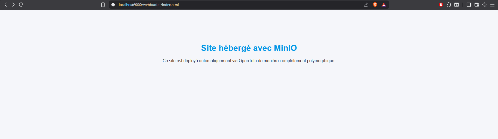

## TP1 Cloud, Esteban BIRET-TOSCANO

---

## 1️⃣ Installation des outils

Les outils installés pour ce TP :

- OpenTofu
- MinIO
- (optionnel) AWS CLI

---

## 2️⃣ Lancement du serveur MinIO

Création du dossier de stockage :

    mkdir ~/minio-data

Lancement du serveur MinIO :

    minio server ~/minio-data --console-address ":9001"

Console MinIO disponible sur :  
http://localhost:9001

Identifiants par défaut :  
- utilisateur : minioadmin  
- mot de passe : minioadmin  

---

## 3️⃣ Création de la configuration OpenTofu

Fichiers créés :

- main.tf
- variables.tf
- outputs.tf
- terraform.tfvars (non versionné)
- index.html
- style.css

Initialisation :

    tofu init

---

## 4️⃣ Déploiement initial de l’infrastructure

Prévisualisation :

    tofu plan

Application du déploiement :

    tofu apply

Ressources créées :

- bucket privé « tp1-cloud-bucket »
- bucket « webbucket »
- upload automatique de index.html
- upload automatique de style.css
- policy publique ciblée uniquement sur ces deux fichiers

---

## 5️⃣ Transformation en site web statique

Le site web statique est composé de :

- index.html
- style.css

Ils sont uploadés dans MinIO via l’IaC.

L’URL du site est :

    http://localhost:9000/webbucket/index.html

---

## 6️⃣ Variables et secrets

Les identifiants MinIO sont externalisés.

Exemple du fichier terraform.tfvars (non versionné) :

    minio_user     = "minioadmin"
    minio_password = "minioadmin"

---

## 7️⃣ Validation complète — Cycle IaC

Suppression totale de l’infrastructure :

    tofu destroy

Recréation complète :

    tofu apply

Vérifications :

- buckets recréés
- fichiers réuploadés
- policy publique appliquée
- site immédiatement accessible

---